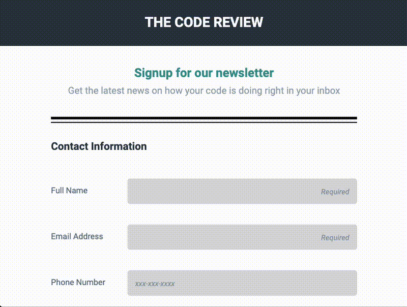

# Newsletter SignUp Form

# Responsive Layout Mock Portfolio
This was a very early-stage project in the Team Treehouse [Front-End Web Development Tech Degree](https://teamtreehouse.com/techdegree/front-end-web-development) program.

The goal of the project was to create a responsive newsletter signup form with customized focus states. It is not a functioning form. I only developed the front-end code.

I completed the Front-End Web Development Tech Degree in 2019. [View my Certificate](https://www.credential.net/1700e85d-d29e-493d-a28e-a8c1860459c8#acc.PS7ITKNb)

[View Live Project](https://heidifryzell.com/fetd-project-3/)

## How It's Made:
### Tech Used:
  

## Optimizations

- The placeholder text in the form and paragraph text at the top of the form does not have sufficient contrast
- The background on focused items should be darker to increase contrast with the white text
- The text in the Newsletter section needs more contrast against the green background
- Add hover state to Sign Up Button
- Use flexbox to reduce the amount of CSS needed

## Lessons Learned

This is the first time I have worked with stylized focus states in forms.

I am updating this README a few years after I completed this assignment for the Team Treehouse Front-End Web Developement Tech Degree, and I have since learned a lot more about web accesibility and I would redo this form's color scheme to have higher contrast. See above under "Optimizations"

## Recent Projects

Here is my current portfolio:

<table border="1">
  <tr>
    <td style="text-align: center;"><a href="https://heidifryzell.com">heidifryzell.com</a></td>
  </tr>
  <tr>
    <td></td>
  </tr>
</table>
